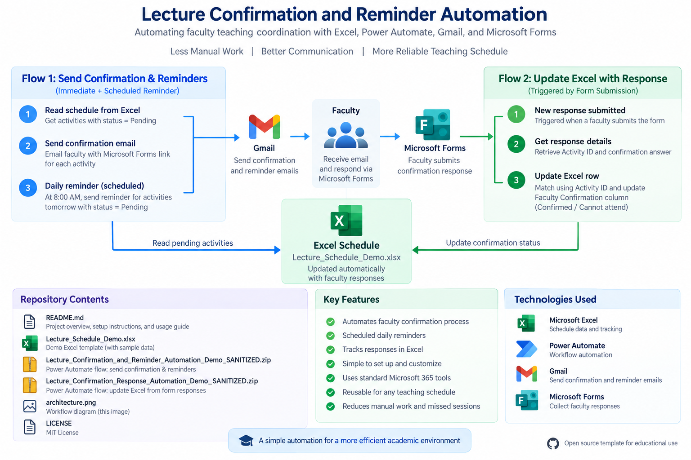

# Lecture Confirmation and Reminder Automation

A Power Automate workflow for automating lecture confirmation, faculty reminders, and response tracking.

## Overview

This project automates faculty teaching coordination using:

- Microsoft Excel
- Power Automate
- Gmail
- Microsoft Forms

## Workflow

1. Read teaching activities from an Excel table.
2. Send confirmation requests to faculty with status `Pending`.
3. Faculty confirm availability through Microsoft Forms.
4. Power Automate updates the matching Excel row using `Activity ID`.
5. Faculty who remain `Pending` continue to receive confirmation requests.
6. A separate reminder branch sends a reminder before the scheduled teaching activity.

## Architecture

Excel Schedule  
→ Power Automate  
→ Gmail  
→ Microsoft Forms  
→ Power Automate  
→ Excel Update

## Status

Working prototype successfully tested in a real academic teaching workflow.

## Privacy

This repository uses fictitious sample data only. No real faculty names, emails, or institutional identifiers are included.

## Installation

1. Download `Lecture_Schedule_Demo.xlsx`.
2. Upload the workbook to OneDrive for Business.
3. Import `Lecture_Confirmation_and_Reminder_Automation_Demo_SANITIZED.zip` into Power Automate.
4. During import, select your own:
   - Excel Online (Business) connection
   - Gmail connection
5. Open the imported flow.
6. In `List rows present in a table`, select:
   - Your uploaded Excel workbook
   - Table: `CourseActivitiesTable`
7. Configure your own Microsoft Forms confirmation link.
8. Save and test the flow before enabling the recurrence.
9. Import `Lecture_Confirmation_Response_Automation_Demo_SANITIZED.zip`.
10. During import, select your own:
    - Microsoft Forms connection
    - Excel Online (Business) connection
11. Configure the response flow to use your own confirmation form.
12. In `Update a row`, select the same Excel workbook and `CourseActivitiesTable`.
13. Use `Activity ID` as the key for updating the faculty confirmation status.
14. Save and test the response flow.

## Excel Requirements

The Excel workbook must contain the table:

`CourseActivitiesTable`

Important fields include:

- Activity ID
- Date
- Start Time
- End Time
- Topic
- Faculty Name
- Faculty Email
- Group
- Location
- Faculty Confirmation

## Confirmation Logic

The confirmation branch processes rows where:

`Faculty Confirmation = Pending`

Faculty who respond are removed from subsequent confirmation reminders once their status is updated.

## Repository Files

- `Lecture_Confirmation_and_Reminder_Automation_Demo_SANITIZED.zip` — confirmation and reminder flow
- `Lecture_Confirmation_Response_Automation_Demo_SANITIZED.zip` — response-processing flow
- `Lecture_Schedule_Demo.xlsx` — fictitious Excel template
- `architecture.png` — workflow architecture diagram
